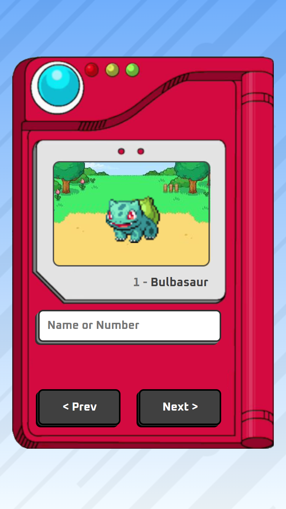

## Criação de Pokédex

O projeto foi realizado seguindo um [tutorial do youtube.](https://youtu.be/SjtdH3dWLa8)

#### Linguagens usadas

-   HTML
-   CSS
-   JS

### API usada

-   [PokéAPI](https://pokeapi.co/)

## Veja o projeto a funcionar [aqui.](https://sanntozzz.github.io/pokedex/)

